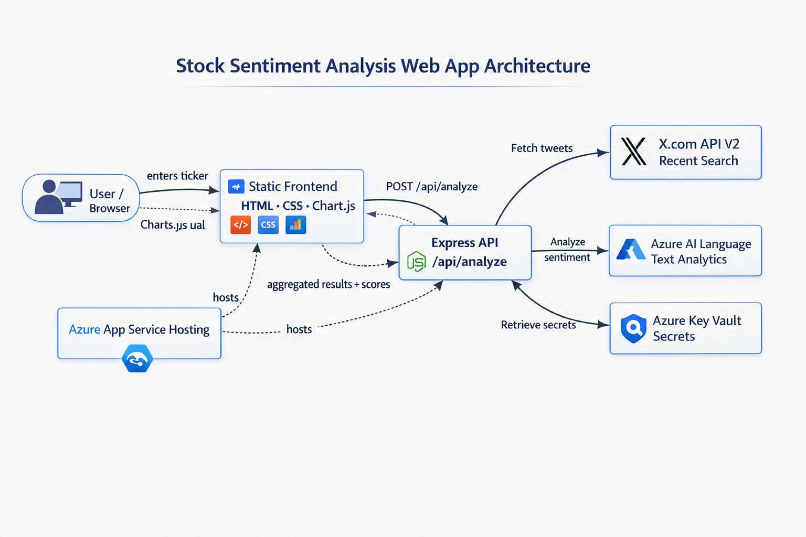

# 📈 Stock Sentiment Analysis


---

## Overview

Stock Sentiment Analysis is a full-stack web application that gauges public sentiment around stock tickers by analysing recent posts from **X.com** (formerly Twitter) using **Azure AI Language (Text Analytics)**. Enter a ticker symbol (e.g. `$MSFT`), and the app will:

1. Fetch recent posts mentioning that ticker via the **X.com API v2**.
2. Run every post through **Azure Text Analytics** sentiment analysis.
3. Aggregate the results into a **Bullish / Bearish / Neutral** summary with confidence scores.
4. Render an interactive **Chart.js** visualisation in the browser.

The backend is a lightweight **Express** API. Infrastructure is defined as code with **Bicep**, secrets are stored in **Azure Key Vault**, and the app is hosted on **Azure App Service**.

---

## Architecture



**Key components:**

| Component | Purpose |
|---|---|
| **Express API** | Receives analysis requests, orchestrates X.com + Azure calls, caches results |
| **X.com API v2** | Supplies recent posts for a given ticker symbol |
| **Azure AI Language** | Returns per-post sentiment labels and confidence scores |
| **Azure Key Vault** | Securely stores the X.com Bearer Token and Text Analytics key at runtime |
| **Azure App Service** | Hosts the Node.js application in the cloud |
| **Chart.js Frontend** | Renders sentiment distribution charts in the browser |

---

## Prerequisites

| Requirement | Minimum version | Install link |
|---|---|---|
| **Node.js** | 18.0.0 | <https://nodejs.org> |
| **npm** | 9.x | Bundled with Node.js |
| **Azure CLI** | 2.50+ | <https://aka.ms/install-azure-cli> |
| **Azure subscription** | — | <https://azure.microsoft.com/free> |
| **X Developer account** | v2 API access | <https://developer.twitter.com> |

---

## Project Structure

```
stock-sentiment-analysis/
├── .github/
│   └── workflows/
│       ├── deploy-app.yml          # CI/CD – application deployment
│       └── deploy-infra.yml        # CI/CD – infrastructure deployment
├── infra/
│   ├── main.bicep                  # Root Bicep template (orchestrator)
│   ├── modules/
│   │   ├── app-service.bicep       # Azure App Service + plan
│   │   ├── cognitive-services.bicep# Azure AI Language resource
│   │   └── key-vault.bicep         # Azure Key Vault + secrets
│   └── parameters/
│       ├── dev.bicepparam          # Parameters for dev environment
│       ├── staging.bicepparam      # Parameters for staging environment
│       └── prod.bicepparam         # Parameters for production environment
├── scripts/
│   └── deploy.sh                   # One-command deploy script
├── src/
│   ├── server.js                   # Express entry point
│   ├── config.js                   # Centralised configuration
│   ├── package.json                # Node.js dependencies
│   ├── .env.example                # Environment variable template
│   ├── routes/
│   │   └── api.js                  # POST /api/analyze endpoint
│   ├── services/
│   │   ├── aggregator.js           # Sentiment aggregation logic
│   │   ├── sentiment.js            # Azure Text Analytics client
│   │   ├── twitter.js              # X.com API v2 client
│   │   └── keyvault.js             # Azure Key Vault secret retrieval
│   └── public/
│       ├── index.html              # Single-page frontend
│       ├── css/                    # Stylesheets
│       └── js/                     # Frontend JavaScript + Chart.js
├── tests/
│   ├── jest.config.js              # Jest configuration
│   ├── validate.sh                 # Full validation suite
│   ├── unit/
│   │   ├── aggregator.test.js      # Aggregation logic tests
│   │   ├── api.test.js             # API route tests
│   │   ├── sentiment.test.js       # Sentiment service tests
│   │   └── twitter.test.js         # Twitter service tests
│   ├── smoke/
│   │   └── health.test.js          # Live health-check test
│   └── coverage/                   # Generated coverage reports
└── README.md
```

---

## Environment Setup

### 1. Copy the environment template

```bash
cp src/.env.example src/.env
```

### 2. Configure Azure Text Analytics

1. Create an **Azure AI Language** resource in the [Azure Portal](https://portal.azure.com/#create/Microsoft.CognitiveServicesTextAnalytics) (or let the Bicep templates create one for you).
2. Copy the **Endpoint** and **Key** from the resource's _Keys and Endpoint_ blade.
3. Set them in `src/.env`:

```dotenv
AZURE_TEXT_ANALYTICS_ENDPOINT=https://<your-resource>.cognitiveservices.azure.com/
AZURE_TEXT_ANALYTICS_KEY=<your-key>
```

### 3. Configure X.com API

1. Apply for a [Twitter/X Developer account](https://developer.twitter.com) with **v2 API** access.
2. Create a project and generate a **Bearer Token**.
3. Set it in `src/.env`:

```dotenv
TWITTER_BEARER_TOKEN=<your-bearer-token>
```

### 4. Optional – Azure Key Vault

When running on Azure, secrets are read from Key Vault instead of environment variables. Set the URI if deploying to the cloud:

```dotenv
KEY_VAULT_URI=https://<your-keyvault>.vault.azure.net/
```

---

## Infrastructure Deployment

The `infra/` directory contains modular Bicep templates. Deploy with the Azure CLI:

```bash
# Create a resource group
az group create --name rg-stocksentiment-dev --location eastus

# Deploy infrastructure (dev)
az deployment group create \
  --resource-group rg-stocksentiment-dev \
  --template-file infra/main.bicep \
  --parameters infra/parameters/dev.bicepparam \
  --parameters location=eastus
```

### Parameter files

| File | Environment | Use case |
|---|---|---|
| `infra/parameters/dev.bicepparam` | Development | Lower-cost SKUs, relaxed throttling |
| `infra/parameters/staging.bicepparam` | Staging | Production-like SKUs, integration testing |
| `infra/parameters/prod.bicepparam` | Production | Full-scale SKUs, stricter security |

Each parameter file supplies `environmentName`, `appName`, and the `twitterBearerToken` (as a secure parameter). Adjust values to match your subscription.

---

## Application Deployment

### Local

```bash
cd src
npm install
npm start          # starts on http://localhost:3000
```

### Azure (via deploy script)

```bash
chmod +x scripts/deploy.sh
./scripts/deploy.sh --resource-group rg-stocksentiment-dev --environment dev
```

The script will:
1. Verify prerequisites (Azure CLI, Node.js, npm).
2. Deploy the Bicep infrastructure.
3. Run `npm ci --production`, package the app as a ZIP, and deploy it to App Service.
4. Execute a smoke test against the `/health` endpoint.

---

## Quick Deploy

`scripts/deploy.sh` supports the following flags:

```
Usage: deploy.sh [OPTIONS]

Options:
  --resource-group    Azure resource group name (required)
  --location          Azure region (default: eastus)
  --environment       Target environment: dev | staging | prod (default: dev)
  --app-name-prefix   Prefix for Azure resource names (default: stocksentiment)
  --infra-only        Deploy only infrastructure (skip app deployment)
  --app-only          Deploy only the application (skip infra deployment)
  --help              Show help
```

### Examples

```bash
# Full deploy to dev
./scripts/deploy.sh --resource-group rg-stock-dev --environment dev

# Production infrastructure only
./scripts/deploy.sh --resource-group rg-stock-prod --environment prod --infra-only

# Redeploy app code to staging (infra already exists)
./scripts/deploy.sh --resource-group rg-stock-staging --environment staging --app-only

# Custom region and name prefix
./scripts/deploy.sh --resource-group rg-custom --location westeurope --app-name-prefix mysentiment
```

---

## Validation

### Full validation suite

```bash
chmod +x tests/validate.sh
./tests/validate.sh
```

This runs all checks in sequence:

1. **Prerequisites** – verifies Node.js, npm, and Azure CLI are installed.
2. **Infrastructure** – compiles the Bicep template and confirms all parameter files exist.
3. **Unit tests** – installs dependencies and runs Jest.
4. **Summary** – prints a colour-coded pass/fail report.

### Unit tests only

```bash
cd src
npm test
```

### Smoke tests (live environment)

```bash
SMOKE_TEST_URL=https://stocksentiment-dev-app.azurewebsites.net \
  ./tests/validate.sh --live
```

The `--live` flag adds an HTTP health-check against the deployed app.

---

## Local Development

```bash
# 1. Clone the repository
git clone <repo-url>
cd stock-sentiment-analysis

# 2. Install dependencies
cd src
npm install

# 3. Create and configure .env
cp .env.example .env
# → fill in AZURE_TEXT_ANALYTICS_ENDPOINT, AZURE_TEXT_ANALYTICS_KEY,
#   and TWITTER_BEARER_TOKEN (see "Environment Setup" above)

# 4. Start the development server (auto-reload via nodemon)
npm run dev
# → http://localhost:3000

# 5. Run tests
npm test
```

---

## API Reference

### `GET /health`

Health-check endpoint for load balancers and monitoring.

**Response** `200 OK`

```json
{
  "status": "healthy",
  "timestamp": "2024-12-15T10:30:00.000Z"
}
```

---

### `POST /api/analyze`

Analyse social sentiment for a stock ticker.

**Rate limit:** 100 requests per 15-minute window.

**Request body**

```json
{
  "ticker": "$MSFT"
}
```

| Field | Type | Required | Description |
|---|---|---|---|
| `ticker` | `string` | Yes | Stock symbol, 1–10 letters. `$` prefix is optional. |

**Response** `200 OK`

```json
{
  "ticker": "$MSFT",
  "posts": [
    {
      "id": "1234567890",
      "text": "Microsoft's AI push is incredible, $MSFT to the moon!",
      "createdAt": "2024-12-15T09:12:00.000Z",
      "authorId": "9876543210",
      "metrics": { "retweet_count": 12, "like_count": 45 },
      "sentiment": "positive",
      "confidenceScores": {
        "positive": 0.94,
        "neutral": 0.04,
        "negative": 0.02
      }
    }
  ],
  "summary": {
    "counts": { "positive": 32, "negative": 8, "neutral": 7, "mixed": 3 },
    "averageScores": { "positive": 0.6123, "neutral": 0.2345, "negative": 0.1532 },
    "overallSentiment": "Bullish",
    "totalAnalyzed": 50
  },
  "cachedAt": "2024-12-15T10:30:00.000Z"
}
```

**Error responses**

| Status | Body | Cause |
|---|---|---|
| `400` | `{ "error": "Missing required field: ticker" }` | No `ticker` in request body |
| `400` | `{ "error": "Invalid ticker symbol..." }` | Ticker fails validation regex |
| `429` | `{ "error": "Too many requests. Please try again later." }` | Rate limit exceeded |
| `500` | `{ "error": "An internal error occurred..." }` | Unexpected server error |
| `503` | `{ "error": "A required service credential is missing..." }` | Missing Key Vault secret |

---

## Demo Guide

### Step 1 – Start the app

```bash
cd src && npm start
```

Open <http://localhost:3000> in your browser.

### Step 2 – Analyse a ticker

Type **`$MSFT`** (or any valid ticker) into the search box and click **Analyze**.

### Step 3 – Review results

The app displays:

- **Overall Sentiment** – a large Bullish / Bearish / Neutral label.
- **Sentiment Distribution Chart** – a Chart.js doughnut chart showing the positive / negative / neutral / mixed breakdown.
- **Average Confidence Scores** – numeric scores (0–1) for each sentiment category.
- **Post List** – each fetched post with its individual sentiment label and confidence scores.

### Step 4 – Inspect the API response

Open your browser's developer tools (**Network** tab) and replay the request. You will see the JSON structure documented in the [API Reference](#api-reference) above.

### Sample JSON response shape

```json
{
  "ticker": "$MSFT",
  "posts": [ "...array of post objects with sentiment..." ],
  "summary": {
    "counts": { "positive": 32, "negative": 8, "neutral": 7, "mixed": 3 },
    "averageScores": { "positive": 0.6123, "neutral": 0.2345, "negative": 0.1532 },
    "overallSentiment": "Bullish",
    "totalAnalyzed": 50
  },
  "cachedAt": "2024-12-15T10:30:00.000Z"
}
```

> **Tip:** Results are cached for 5 minutes (configurable via `CACHE_TTL`). Subsequent requests for the same ticker return instantly with `"cached": true`.

---

## Troubleshooting

### X.com API – `429 Too Many Requests`

The X.com v2 API enforces strict rate limits. If you see `429` errors:

- Wait 15 minutes for the rate-limit window to reset.
- Reduce `MAX_TWEETS` in `.env` to lower the number of tweets fetched per request.
- Enable caching (`CACHE_TTL`) to avoid repeat calls for the same ticker.

### Azure Text Analytics – `401 Unauthorized`

- Verify `AZURE_TEXT_ANALYTICS_ENDPOINT` and `AZURE_TEXT_ANALYTICS_KEY` are correct in your `.env`.
- Ensure the key has not been regenerated in the Azure Portal without updating your config.
- On Azure, confirm the App Service's managed identity has the **Cognitive Services User** role on the AI Language resource.

### CORS Errors

The app uses the `cors` middleware with default settings (all origins allowed). If you restrict origins:

- Check that the `cors()` configuration in `src/server.js` includes your frontend domain.
- When calling the API from a different domain, ensure `Access-Control-Allow-Origin` is set.

### Key Vault – `403 Access Denied`

- Confirm `KEY_VAULT_URI` is set correctly.
- Verify the App Service's **system-assigned managed identity** is enabled.
- Ensure the managed identity has the **Key Vault Secrets User** role (or an equivalent access policy) on the Key Vault.

### App Starts But Analysis Fails

- Check that **both** `AZURE_TEXT_ANALYTICS_ENDPOINT` and `TWITTER_BEARER_TOKEN` are configured.
- The config module validates `AZURE_TEXT_ANALYTICS_ENDPOINT` at startup and will throw immediately if it is missing.
- Review server logs: `console.error` output will point to the failing service.

---

## Disclaimer

> **This application is for educational and informational purposes only.** Sentiment analysis results do not constitute financial advice. Stock trading carries risk; always conduct your own research before making investment decisions. The authors assume no liability for financial losses incurred by acting on the output of this tool.

---

## License

This project is licensed under the [MIT License](LICENSE).
